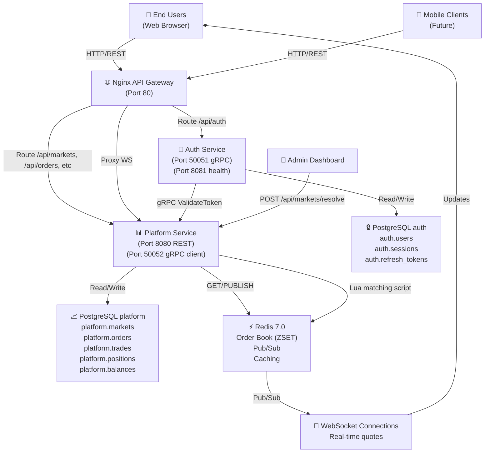
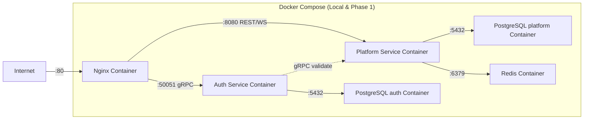
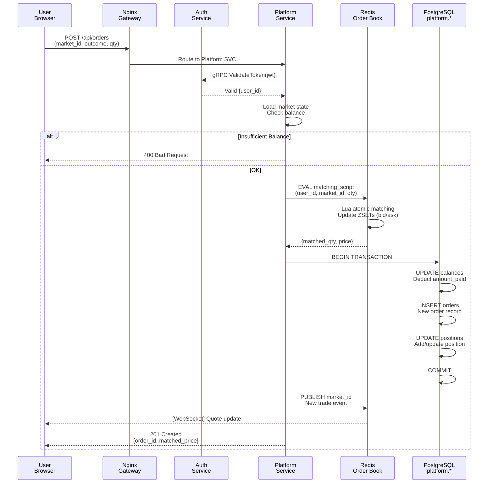
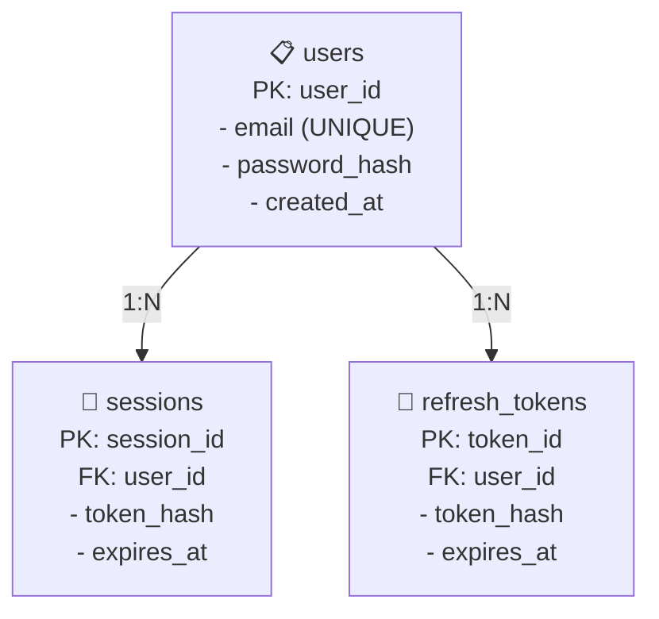
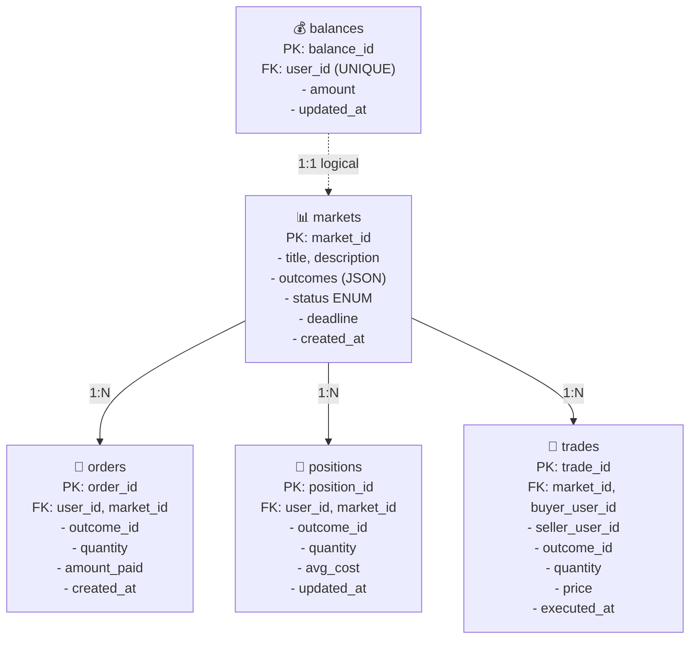
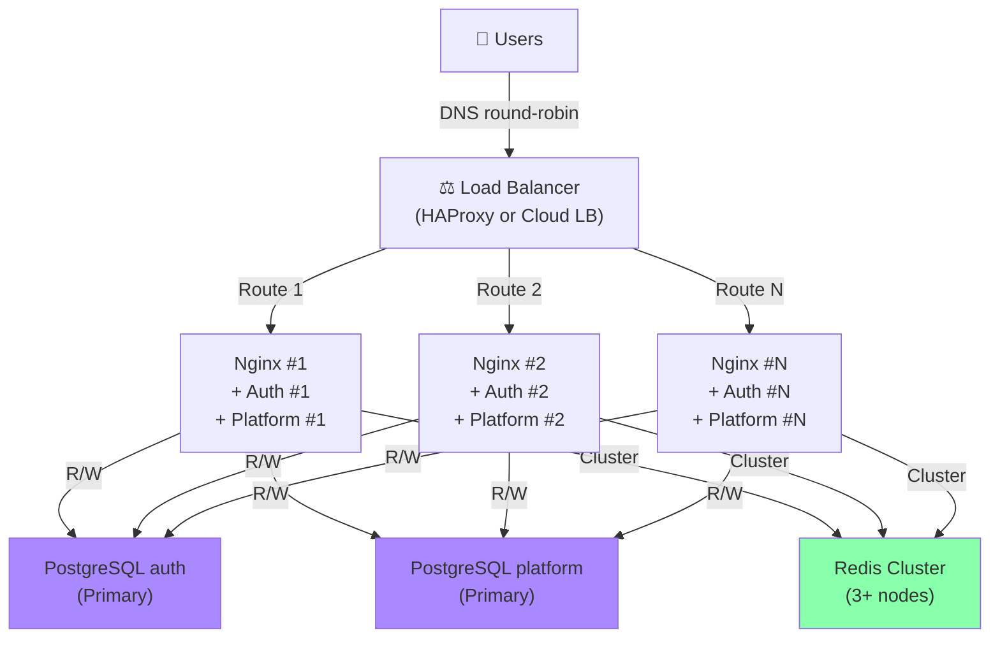
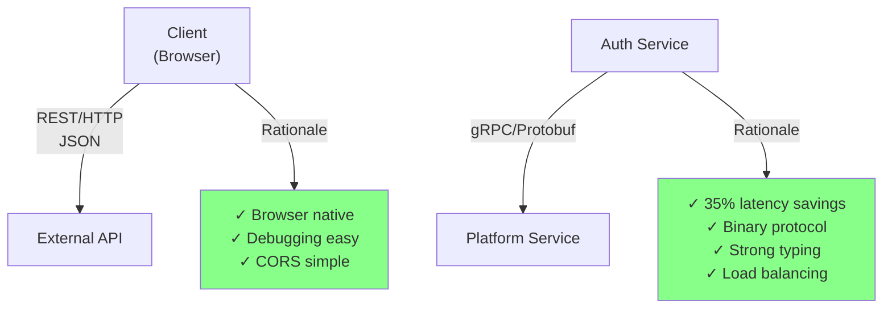
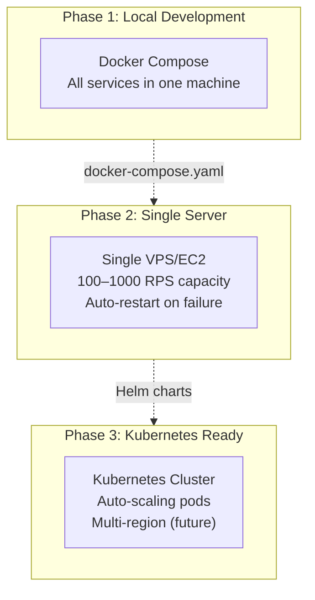
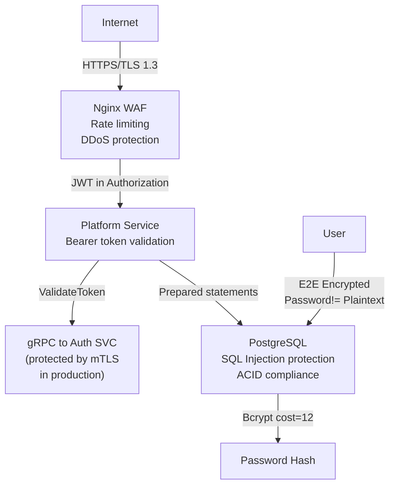

# Architecture Diagram — Variator2026

## System Overview



---

## Deployment Architecture (Phase 1)



---

## Data Flow (User Places Trade)



---

## Database Schema (Logical)

### auth.* (Auth Service owns)



### platform.* (Platform Service owns)



---

## Redis Data Structures

```mermaid
graph TB
    Redis["Redis 7.0"]
    
    CLOB["Order Book (CLOB)"]
    Redis -->|ZSET| CLOB
    CLOB -->|markets:{market_id}:bids| BidsZSET["Sorted Set<br/>Score=price<br/>Member=user_id:qty"]
    CLOB -->|markets:{market_id}:asks| AsksZSET["Sorted Set<br/>Score=price<br/>Member=user_id:qty"]
    
    PubSub["Pub/Sub"]
    Redis -->|SUBSCRIBE| PubSub
    PubSub -->|market:{market_id}| TradeEvents["Trade Events<br/>{type, qty, price}"]
    PubSub -->|market:{market_id}| QuoteUpdates["Quote Updates<br/>{bid, ask, last_price}"]
    
    Cache["Caching (Optional)"]
    Redis -->|STRING| Cache
    Cache -->|market:{market_id}:last_quote| QuoteCache["Last quote<br/>TTL=30s"]
    Cache -->|user:{user_id}:balance| BalanceCache["Cached balance<br/>TTL=5s"]
```

---

## Load Balancing (Phase 2)



---

## Inter-Service Communication (gRPC)

```mermaid
graph LR
    PlatformSVC["Platform Service"]
    AuthSVC["Auth Service"]
    
    PlatformSVC -->|gRPC/Protobuf| ServiceDef["proto/auth.proto<br/>service AuthService {<br/>  rpc ValidateToken<br/>  rpc GetUser<br/>}"]
    
    ServiceDef -->|Port 50051| AuthSVC
    
    Auth -->|JWT inside Authorization header| PlatformSVC
    PlatformSVC -->|ValidateTokenRequest {token}| AuthSVC
    AuthSVC -->|ValidateTokenResponse {user_id, role}| PlatformSVC
    
    PlatformSVC -->|Cache validation result<br/>TTL=5min| Redis["Redis"]
```

---

## HTTP vs gRPC Decision



---

## Deployment Targets



---

## Security Layers



---

## Performance Optimization Strategy

```mermaid
graph TB
    Bottleneck["Identified Bottleneck"]
    Bottleneck -->|High-load endpoint<br/>GET /api/markets/{id}/book| Problem["10k+ req/sec to<br/>market quotes"]
    
    Problem -->|Solution| Redis["Redis CLOB<br/>In-memory order book<br/>Sorted Sets (ZSET)"]
    
    Problem -->|Alternative rejected| PSQL["PostgreSQL<br/>Too slow for quotes<br/>>> 1000 RPS"]
    
    Redis -->|Result| Improvement["✓ 200ms latency (SLO)<br/>✓ 99.5% uptime<br/>✓ Real-time updates via Pub/Sub"]
```

---

**Architecture Version:** 2.0 (Microservices)  
**Last Updated:** 7 апреля 2026  
**Status:** Ready for implementation (Phase 1)
