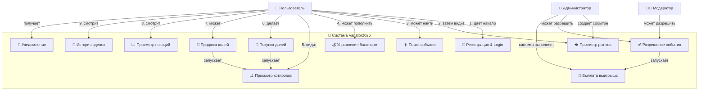
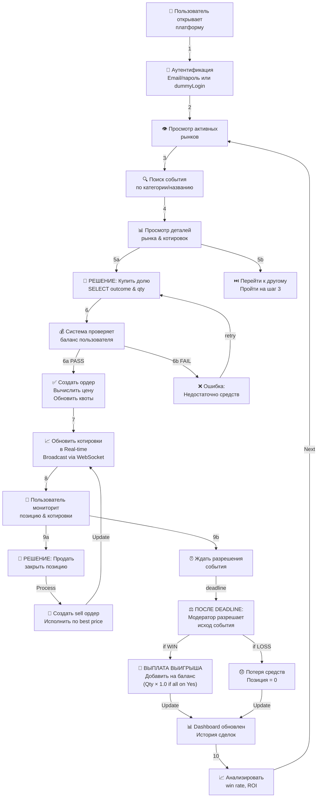
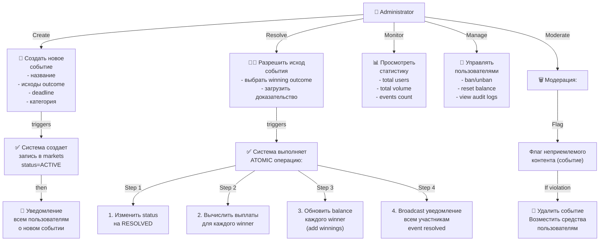
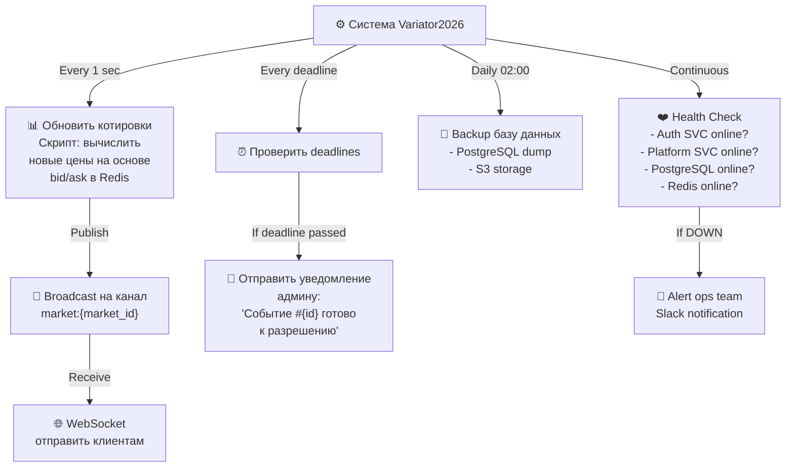
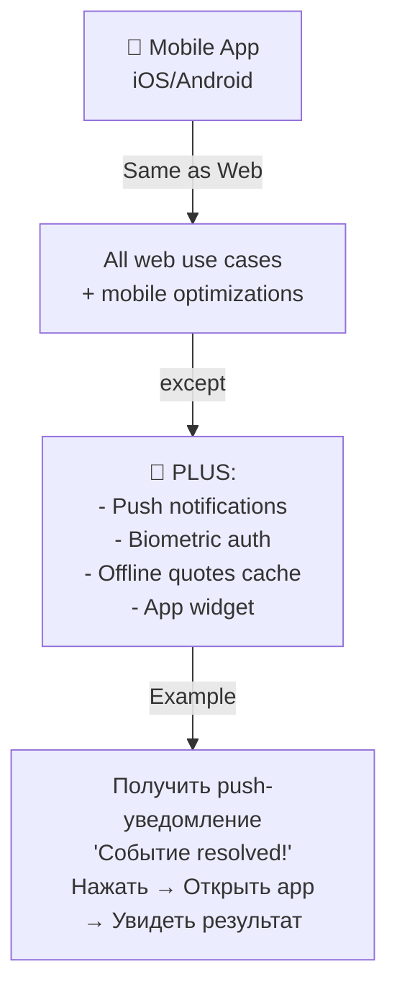
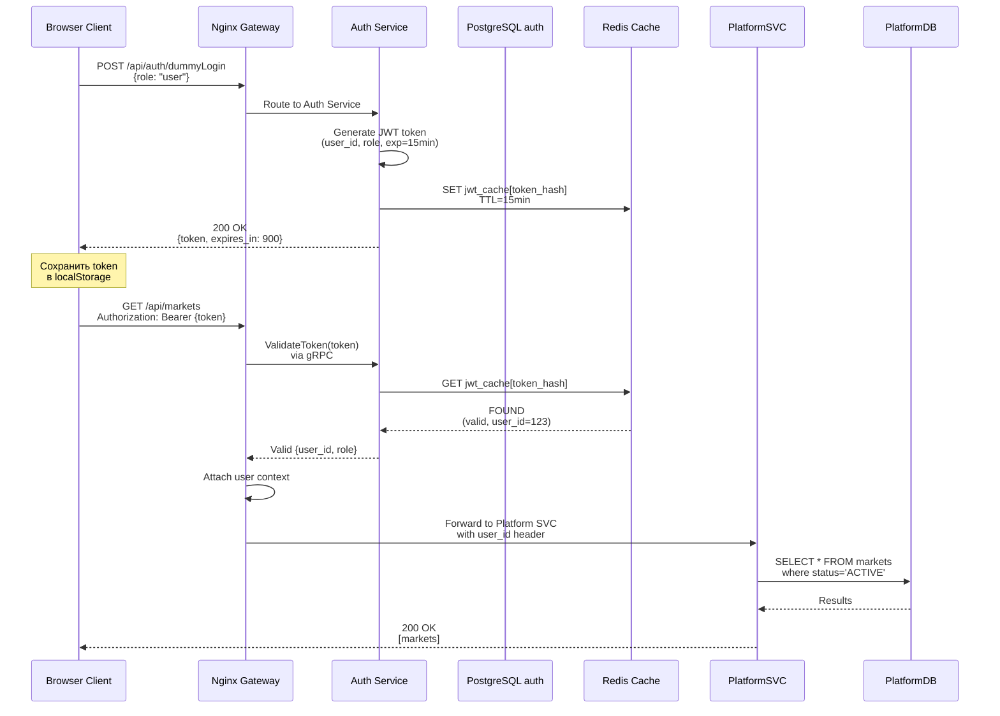
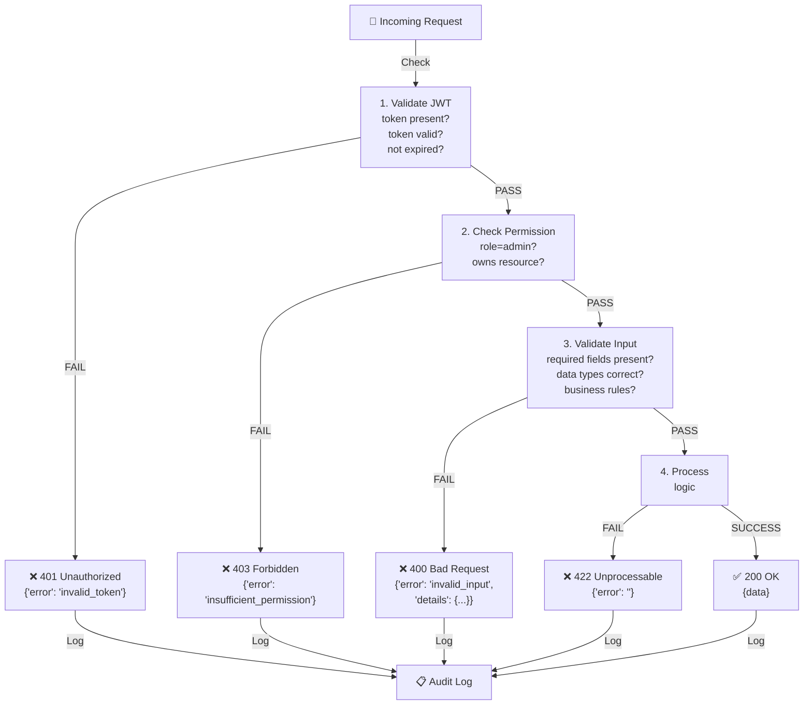
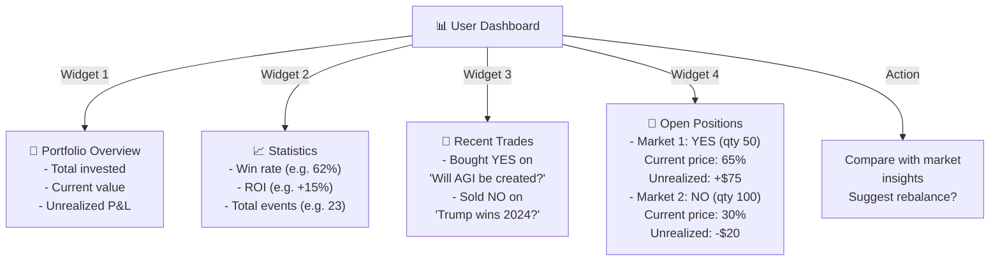
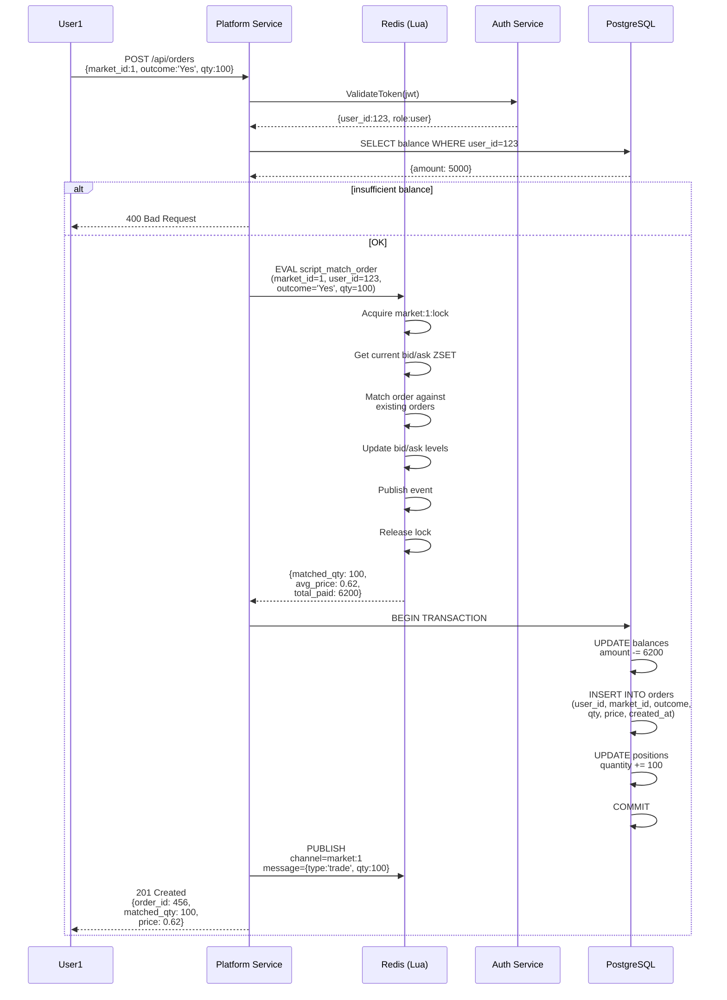

# Use Case Диаграммы — Variator2026

## Основная диаграмма: Взаимодействие пользователя с системой



---

## Детально: Lifecycle сделки (Trade Lifecycle Use Case)



---

## Admin / Moderator Use Cases



---

## System Use Cases (Non-human actors)



---

## Mobile App Use Cases (Future)



---

## Detailed: Login Flow (Authentication Use Case)



---

## Error Handling Use Case



---

## Concurrency: Race Condition Prevention

```mermaid
graph TB
    User1["👤 User 1"]
    User2["👤 User 2"]
    
    User1 -->|Post BUY order<br/>- market 1<br/>- Yes outcome<br/>- qty 100| Order1["📝 Order 1"]
    User2 -->|Post BUY order<br/>- market 1<br/>- Yes outcome<br/>- qty 50| Order2["📝 Order 2"]
    
    Order1 -->|time=T| Redis["Redis Single Thread<br/>Lua Script (ATOMIC)"]
    Order2 -->|time=T+1ms| Redis
    
    Redis -->|Step 1: Acquire lock<br/>market:1:lock| Lock["🔐 Distributed Lock"]
    Redis -->|Step 2: Update ZSET<br/>bid/ask levels| ZSET["Order Book<br/>ZSET update"]
    Redis -->|Step 3: Calculate matching| Matching["matching algorithm"]
    Redis -->|Step 4: Emit event<br/>to Pub/Sub| Event["trade:market:1"]
    Redis -->|Step 5: Release lock| Lock
    
    Note over Redis: ATOMICITY GUARANTEED<br/>No double-spend possible
    
    Redis -->|each order gets| Result1["✅ matched quantities<br/>✅ prices per outcome"]
    Redis -->|each order gets| Result2["✅ no race condition"]
```

---

## Dashboard/Analytics View (v2+)



---

## Sequence: Full Trade Execution with Matching



---

**Use Cases Version:** 2.0  
**Last Updated:** 7 апреля 2026  
**Coverage:** All functional requirements from old report + new features
